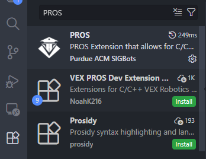
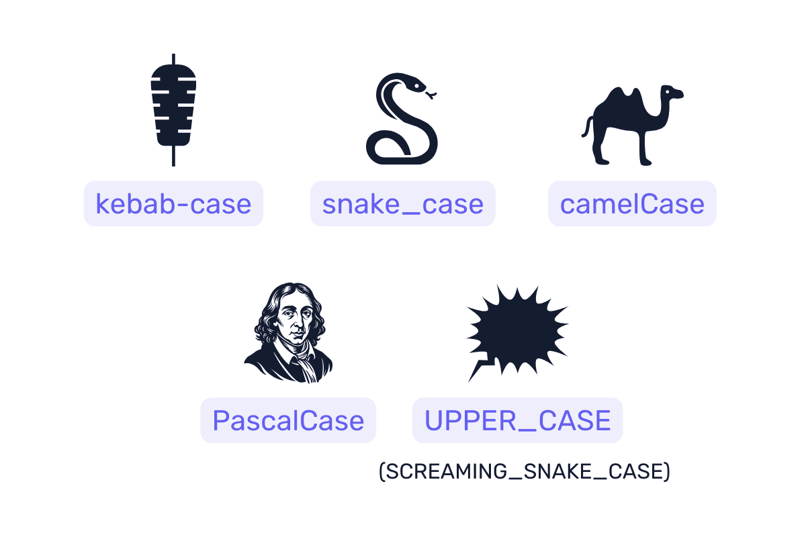

# UACH1

## Install PROS:

In Visual Studio Code, go to Extension section and search for "**PROS**"



Once you have installed, you can start developing.

The instalation should install automatically the Toolchain and PROS CLI, however, this process may fail, so you might install them manually.

Toolchain is required for compilation of code, while CLI is required for upload code to the Brain.

PROS guide for [manual installation](https://pros.cs.purdue.edu/v5/getting-started/windows.html), [CLI github](https://github.com/purduesigbots/pros-cli/releases), [Toolchain github](https://github.com/purduesigbots/toolchain/releases).

---

## Install Lemlib (autonomous library):

```
pros c add-depot LemLib https://raw.githubusercontent.com/LemLib/LemLib/depot/stable.json
pros c apply LemLib
```

*These commands must be executed in a terminal located in the project folder.*

---

## Notation Convention



UPPER_CASE for `constants` values

`#define SENSOR_PORT 21`

camelCase (lowerCamelCase) for `variables`, `functions` / `attributes`,`methods`:

```
int velocityOfRobot = 0;
autonomous() {};
robot.actualSpeed;
robot.turnToHeading({parameters});
```

PascalCase for `classes` :

`class Robot {}`

---

## Authors

[Edgar Klassen](https://github.com/nekomimint)

[Jesus Gonzalez](https://github.com/CronosKnight)

Pending to add.
